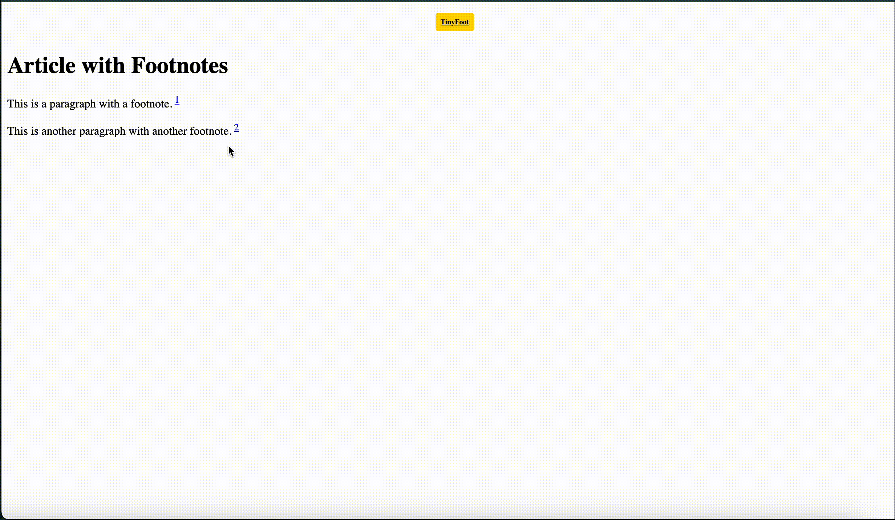

# Code Review

## Project Overview

This project implements a webpage with an article containing footnotes that dynamically display in a side menu when clicked. The project consists of the following files:

1. `demo/index.html`: The main HTML structure of the webpage.
2. `script.js`: The JavaScript logic for handling footnote interactions.
3. `styles.css`: The CSS styling for the webpage, including animations for the side menu and styles for footnotes.

---

### How to Run the Project

To view the webpage, you can open the `demo/index.html` file in your browser using an IDE with Live Server extension or directly. If you're using an IDE, make sure to install the Live Server extension, then simply right-click on the `index.html` file and select "Open with Live Server." Alternatively, you can navigate to the `demo` folder of the project and double-click the `index.html` file to open it directly in your browser. No additional setup or tools are required—just a web browser or an IDE with Live Server.

## 

### 1. `index.html`

#### **Summary**

This file defines the structure of the webpage, consisting of a main article section and an initially hidden side menu for displaying footnotes. Key features include:

- A centered header titled **"TinyFoot"**.
- Two paragraphs, each containing footnotes with IDs `fn1` and `fn2`, where the footnote text is directly embedded in the paragraph via `<a>` tags.
- The document includes links to jQuery for DOM manipulation and `script.js` for custom behavior.

#### **Strength**

- The structure is well organized, with proper HTML semantics such as headings (`<h1>`), paragraphs (`
`), and the use of `<a>` tags to represent footnotes.
- The use of an external script (`script.js`) and external styles (`styles.css`) makes the code modular and maintainable.
- Accessibility is addressed through attributes like `lang="en"` and meta tags for `charset` and `viewport`, ensuring responsiveness and proper encoding.

---

### 2. `script.js`

#### **Summary**

The JavaScript file handles the behavior for displaying footnotes in a side menu. Key functionality includes:

- Sanitizing footnote content to prevent XSS.
- Error handling for potential issues in loading footnotes.
- Event listeners to open and close the side menu when footnotes are clicked.
- Dynamic sessionStorage management to optimize loading performance.

#### **Strength**

- **Security**: The `sanitizeHTML` function effectively mitigates potential XSS attacks by ensuring footnote content is properly sanitized before being displayed.
- **Error Handling**: The `handleError` function logs error messages, aiding debugging and providing feedback when issues arise with footnote interactions.
- **Optimization**: The use of `sessionStorage` for caching footnotes reduces the need to repeatedly fetch the same content, enhancing performance.

---

### 3. `styles.css`

#### **Summary**

The CSS file defines the styles for the webpage, with an emphasis on the side menu for footnotes. It includes key design elements such as:

- Animations for opening the side menu (`@keyframes menuSlideIn`).
- Theme variables for consistent styling across different components.
- Styles for footnotes, headers, and interactive elements such as the "Close Menu" button.

#### **Strengths**

- **CSS Variables**: The use of `:root` for defining global variables ensures consistent styling and improves maintainability by allowing changes to be made in one place.
- **Animations**: The `menuSlideIn` keyframe is a smooth, well-designed animation for revealing the side menu, adding a polished user experience.
- **Responsive Design**: The CSS includes considerations for different screen sizes, particularly in how the side menu is handled and positioned.
- **Hover Effects**: The hover effects for the footnote links and the "TinyFoot" heading add interactivity and engagement for users.

**Note:**
In our case, the dist and demo folder are the same because we implemented the footnote library using vanilla JS and jQuery.

---
